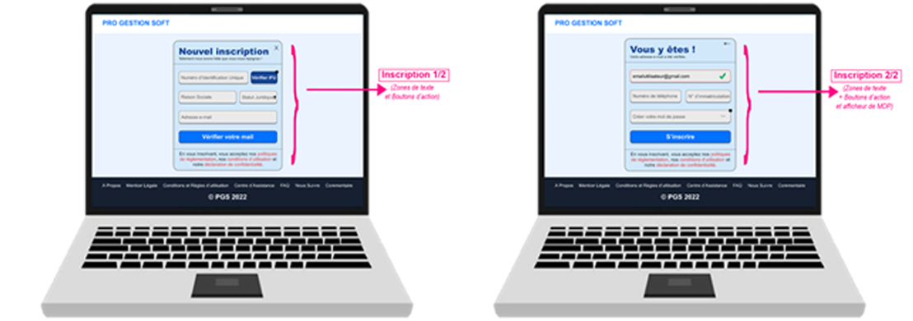

import '../docs.css';

# <i class="fas fa-user-plus"></i> Registration

Registering on **PRO GESTION SOFT** is a simple yet essential process to ensure the security and authenticity of each user. It takes place at `https://progestionsoft.com/register` and is divided into two distinct steps aimed at gathering precise information and validating your identity.  

Here’s a detailed overview of each step:

## Step One: Providing basic information
In this first phase, you will be asked to provide basic information to create your account. This information includes:

-	[IFU Number (Unique Tax Identification Number)](/intro.mdx#Terminologie): This number identifies the entity and is required for legal and administrative purposes.
-	Company Name: This is the official name of the business or organization.
-	Legal Status: This information specifies the legal type of the entity (e.g., LLC, SA, SAS, etc.).
-	Email Address: Make sure to provide a valid and accessible email address, as it will serve as the primary communication channel. 

After entering this information, a six-digit verification code will be sent to the provided email address. This code is essential to confirm that you are the owner (or an authorized administrator) of this address. This step also verifies that the email address is active and functional.

## Step Two: Validation and finalization of registration
Once the email has been successfully verified, you can proceed to validate your registration by providing additional information. During this step, you will be asked to provide the following information:

-	Phone Number: This number can be used for future communications if needed or for further verifications.
-	[Registration Number (TPPCR)](/intro.mdx#Terminologie): A valid registration number is required to legally identify the entity.
-	Password: Choose a secure password. It must be at least eight (8) characters long and include:
    - one digit
    - one symbol
    - one uppercase letter
    - one lowercase letter  

Ensure that your password meets these criteria to secure your account and avoid any risk of compromise.

:::note
-	***Mandatory fields***: All the fields mentioned above are mandatory. You will not be able to finalize your registration without filling in each field. It is also essential to review and accept our *[Terms of service](https://progestionsoft.com/privacy)* and our *[Data processing policy](https://progestionsoft.com/privacy)* before submitting your registration.
-	***Data collection***: The information collected is intended to ensure transparent use of our services and to protect your account against any fraud attempts.

## Video: Registration on PGS  

<iframe
  src="https://www.youtube.com/embed/KAKnJ42iaKg"
  title="Registration on PGS"
  frameborder="0"
  allow="accelerometer; autoplay; clipboard-write; encrypted-media; gyroscope; picture-in-picture"
  allowfullscreen>
</iframe>

